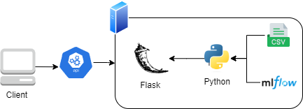

# Despliegue de modelos

## Infraestructura

- **Nombre del modelo:** predictor_pelicula
- **Plataforma de despliegue:** maquina local
- **Requisitos técnicos:** 
    - **Software**:  
        * Python: 3.8.3 
        * Postman 10.15.5
        * Sistema operativo (de preferencia)
    - **Hardware:**
        * Espacio en disco duro 5,30 MB 
        * Procesador 2.10 GHz
        * Ram 2,95 GB
    - **Librerias python:**
        * translate-3.6.1
        * pandas 1.0.5
        * json 2.0.9

- **Requisitos de seguridad:** Debido a que es un ejemplo academico no se configura seguridad
- **Diagrama de arquitectura:**  
    

## Código de despliegue

- **Archivo principal:** [archivo](../../scripts/evaluation/Despliegue_y_disponibilizacion_.ipynb)
- **Rutas de acceso a los archivos:** [archivo](../../scripts/evaluation/Despliegue_y_disponibilizacion_.ipynb)
- **Variables de entorno:** NA

## Documentación del despliegue

- **Instrucciones de instalación:** (instrucciones detalladas para instalar el modelo en la plataforma de despliegue)
- **Instrucciones de configuración:** (instrucciones detalladas para configurar el modelo en la plataforma de despliegue)
- **Instrucciones de uso:** (instrucciones detalladas para utilizar el modelo en la plataforma de despliegue)
- **Instrucciones de mantenimiento:** (instrucciones detalladas para mantener el modelo en la plataforma de despliegue)
